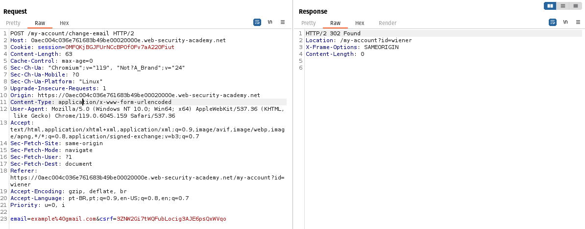
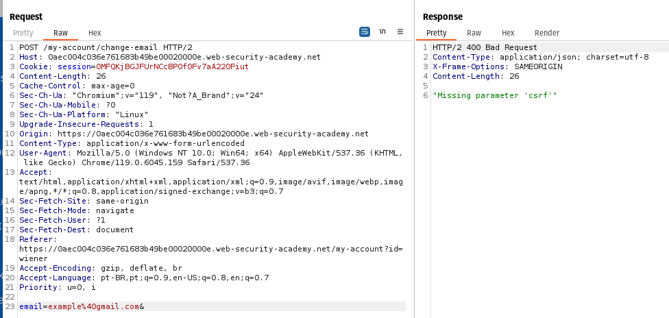
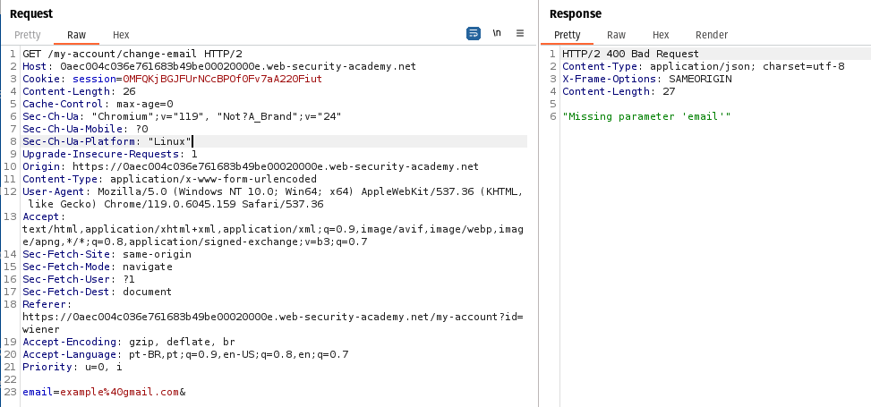

# Lab: CSRF where token validation depends on request method

- link to lab: https://portswigger.net/web-security/csrf/bypassing-token-validation/lab-token-validation-depends-on-request-method

## Steps and deep understanding

In this laboratory, I found a "change email address" function which is vulnerable to CSRF. There is a protection against CSRF using a token to validate the origin of the request

The first step is: also viewed in the title, the tip is: 'depends on request method'

So, I changed my email to intercept the request using burp suite to analyze it:



let's send it to Repeater and try the same request without the CSRF token:



Then, I only change the request method to GET to see what happens:



Basically, the app doens't care here about the CSRF, let's use this case to craft our malicious HTML and solve the lab delivering into the exploit server:
```
<form action="https://YOUR-LAB-ID.web-security-academy.net/my-account/change-email">
    <input type="hidden" name="email" value="email@example.com">
</form>
<script>
        document.forms[0].submit(); // auto submit the form
</script>
```

- Without define the method, it will be a GET
- I don't know why, but, the value goes automatically to a parameter change-email?email=examplehere
- Delivering the exploit to the victim and solving the lab:

